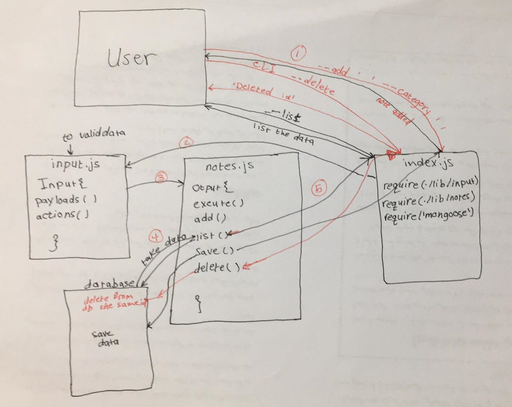

# notes

# LAB - Class 03
- Project: Notesy
- Author: Sondos Alayyan
## Links and Resources
- [submission PR](https://github.com/sondos-401-advanced-javascript/notes/pull/6)
- [github action](https://github.com/sondos-401-advanced-javascript/notes/actions)

## Documentation

## Modules
- note.js
- input.js

## Setup
- minimist 
- estlint
- jest

How to initialize/run your application (where applicable) by using this command line (node index.js -a "the note" --category 'scool') or (node index.js --add "the note" --category 'scool').
for the list data use (node index.js --list) or (node index.js --list 'category') to search by category.
to delete note (node index.js --delete idofnote)
- **I added the update to update the note text by using this command line `node index.js --update 'id' --text 'your new note text'`

How to use your library (where applicable) Tests How do you run tests? 

- I use `npm run lint` to test the indentation errors(eslint).
- I use `npm test` to test poth modules note.js and input.js

## UML
