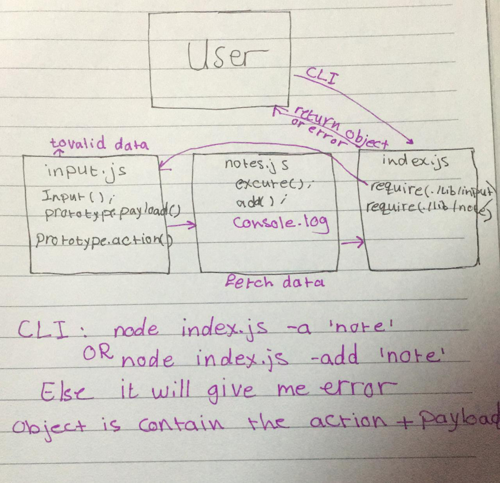

# notes

# LAB - Class 01
- Project: Notesy
- Author: Sondos Alayyan
## Links and Resources
[submission PR](https://github.com/sondos-401-advanced-javascript/notes/pull/2)

## Documentation

## Modules
- note.js
- input.js

## Setup
- minimist 
- estlint

How to initialize/run your application (where applicable) by using this command line (node index.js -a "the note") or (node index.js -add "the note") or (./index.js -a "the note")

How to use your library (where applicable) Tests How do you run tests? 

I use npm run lint to test the indentation errors(eslint)

## UML

# LAB - Class 02
- Project: Notesy
- Author: Sondos Alayyan
## Links and Resources
[submission PR](https://github.com/sondos-401-advanced-javascript/notes/pull/3)

## Documentation

## Modules
- note.js
- input.js

## Setup
- minimist 
- estlint
- jest

How to initialize/run your application (where applicable) by using this command line (node index.js -a "the note") or (node index.js -add "the note") or (./index.js -a "the note")

How to use your library (where applicable) Tests How do you run tests? 

- I use `npm run lint` to test the indentation errors(eslint).
- I use `npm test` to test poth modules note.js and input.js

## UML
